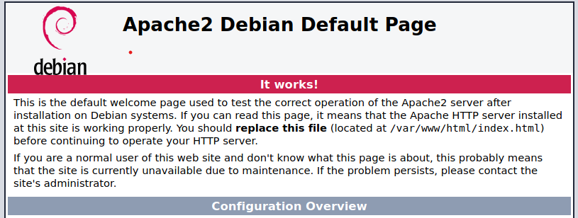
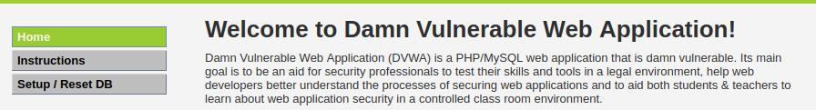

# ModSecurity (+DVWA) Research Lab


Table of Contents
=================

* [ModSecurity (+DVWA) Research Lab](#modsecurity-dvwa-research-lab)
   * [0. Environment/Pre-installing](#0-environmentpre-installing)
   * [1. DVWA Intro](#1-dvwa-intro)
   * [2. DVWA basic Set up (Manual)](#2-dvwa-basic-set-up-manual)
      * [2.1 Build DVWA Apache website:](#21-build-dvwa-apache-website)
      * [2.2 Create DVWA user in local database:](#22-create-dvwa-user-in-local-database)
      * [2.3 (Optional) Completed install remaining component:](#23-optional-completed-install-remaining-component)
   * [3. WAF Intro (ModSecurity)](#3-waf-intro-modsecurity)
   * [4. Feature &amp; Deployment selection:](#4-feature--deployment-selection)
   * [5. WAF installation (Manual)](#5-waf-installation-manual)
      * [Install ModSecurity](#install-modsecurity)
      * [Pre-configuring](#pre-configuring)
      * [Setting Up <a href="https://github.com/coreruleset/coreruleset">the OWASP ModSecurity Core Rule Set</a> (Official repo).](#setting-up-the-owasp-modsecurity-core-rule-set-official-repo)
      * [Enabling ModSecurity in Apache 2](#enabling-modsecurity-in-apache-2)
      * [Testing ModSecurity](#testing-modsecurity)
   * [6. ModSecurity Rule Research](#6-modsecurity-rule-research)
   * [7. (Bonus) Everything-as-scripts](#7-bonus-everything-as-scripts)

<!-- Created by https://github.com/ekalinin/github-markdown-toc -->


## 0. Environment/Pre-installing

| Category        | Specs                        |
| --------------- | ---------------------------- |
| OS              | Kali Linux 2023.1 (ISO File) |
| VM Platform     | VMware                       |
| Network Adapter | NAT                          |
| Apache Version  | Apache/2.4.55 (Debian)       |
| PHP Version     | 8.2.2                        |

If your PHP version is different, i would like to recommend to use **PHP 8.2**, you should always have the latest PHP and Apache version through the latest [Kali Linux release](https://www.kali.org/get-kali/). For instance, Kali Linux 2021 supports **PHP 7.4**, we should have some step to update it to that version. Go to [script](script) folder, run executable file as `root` user:

```bash
sudo chmod 777 setup-php8.2-environment.sh
sudo ./setup-php8.2-environment.sh
```

Now check PHP version again !

If you know how to set up **DVWA** and **ModSecurity**, please proceed to ... . Otherwise, you can follow my instructions or reference to below links:<br>
DVWA: https://github.com/digininja/DVWA <br>
Modsecurity: https://github.com/SpiderLabs/ModSecurity

## 1. DVWA Intro

DVWA stands for Damn Vulnerable Web Application, it is a PHP/MySQL web application that contains a variety of known vulnerabilities, . It was designed to help web developers and security professionals learn about web application security

The application is divided into different security levels, ranging from low to high

## 2. DVWA basic Set up (Manual)

### 2.1 Build DVWA Apache website:

By defautl, codebase of Apache Server is deployed at `/var/www/html `

```bash
cd /var/www/html
```

Placing all the repo's source code in here.

```bash
git clone https://github.com/digininja/DVWA.git
```

Change permission(full-privileged) for execution:

```bash
sudo chmod 777 DVWA
```

Start `apache2` service:

```bash
sudo service apache2 start
```

Browse to `http://127.0.0.1/`; if you see this, you have successfully deployed the Apache server.

<p align="center"> </p>

Then following instruction in repo from here, **DVWA** offers a dummy copy of its _config file_ for you to copy into place and then make the appropriate changes

```bash
cd DVWA
sudo cp config/config.inc.php.dist config/config.inc.php
```

Access to `http://127.0.0.1/DVWA`. You should be able to see the **Welcome Page**:

<p align="center"> </p>

### 2.2 Create DVWA user in local database:

Start `mysql` and `mariadb` service:

```bash
sudo service mysql start
sudo service mariadb start
```

Access user `root` for making changes to database:

```bash
sudo mysql -u root -p
```

Enter your system password. Then go through each of the following command respectively to create user `dvwa` with default password (P@ssw0rd) in `config/config.inc.php`:

```mysql
create database dvwa;
create user dvwa@localhost identified by 'p@ssw0rd';
grant all on dvwa.* to dvwa@localhost;
flush privileges;
use dvwa;
exit;
```

Access `http://127.0.0.1/DVWA/setup.php` for final setup, click on **"Create/Reset database"**. Then you're able to access challenge resources. These are enough for basic WAF testing.

> Note1: Default login credential (username-password): `admin` - `password`

> Note2: In main page, go to "DVWA Security" tab and set the difficulty to `Low` for quick testing. Go to **SQL Injection** and type `1'` in placeholder, if popping up an error message page it means it's working.

### 2.3 (Optional) Completed install remaining component:

After setting up with basic resources, we're good to go and test the demo website; but in case you want all challenge to be avaiable, refer to this section. Go to `http://127.0.0.1/DVWA/setup.php` to check the available function's status:

`PHP function allow_url_include`

Go to PHP configuration file at `/etc/php/{YOUR_PHP_VERSION}/apache2/php.ini`. For example, in my system:

```bash
sudo nano  /etc/php/8.2/apache2/php.ini
```

**Ctrl + W** to search -> Type "allow_url_include" -> Enter -> Rewrite "Off" to "On" -> Save

Restart service `apache2`

```bash
sudo service apache2 restart
```

`PHP module gd`

Install `php-gd`

```bash
sudo apt update
sudo apt install php8.2-gd
```

> Note: My current PHP version is 8.2 which supports `php8.2-gd`. Use can examine whether a PHP version support additional module by `apt`, for example:

```bash
sudo apt-cache pkgnames | grep "php8.2"
```

Then find the appropriate version for Apache2

```bash
sudo apt-cache pkgnames | grep "apache2" | grep php
```

`Writable folder /var/www/html/DVWA/hackable/uploads/`

By default, user `www-data` is used to run the webserver. As above, we've changed permission to `777` and used as `root` user, so this section turned to **Yes**; if not, for properly configured

```bash
sudo chown www-data -R /var/www/html/DVWA/hackable/uploads/
```

`Writable folder /var/www/html/DVWA/config`

```bash
sudo chown www-data -R /var/www/html/DVWA/config
```

`reCAPTCHA key`

This key is only required when you are intending to expose this website to public access. [Follow official repo] This setup is very simple. Edit file `config/config.inc.php`:

```php
$_DVWA[ 'recaptcha_public_key' ] & $_DVWA[ 'recaptcha_private_key' ]
```

These values need to be generated from: https://www.google.com/recaptcha/admin/create

That's all, I just love the "green" color :>

## 3. WAF Intro (ModSecurity)

**ModSecurity** is a web application firewall (WAF) that provides an additional layer of security for web applications. It is an open source module for the Apache, IIS and Nginx HTTP Server that helps protect websites having web vulnerabilities (SQLi, XSS, Path Traversal, ...).

The module works by analyzing incoming HTTP requests and applying a set of rules to identify and block potential attacks. These rules can be customized to meet the specific security requirements of a website or application.

## 4. Feature & Deployment selection:

List of comprehensive functions:

- Prevent attacks to web application (Apache support)
- Open-source
- Logging and monitoring
- SSL/TLS support
- Customizable rules

Deployment method:

- **Embedded** : deploy along with Web Server itself (one VM only)
- **Reverse Proxy** : seperate as a node standing in front of Web Server

## 5. WAF installation (Manual)

### Install ModSecurity

Source: https://www.linode.com/docs/guides/securing-apache2-with-modsecurity/

```bash
sudo apt install libapache2-mod-security2 -y
```

After installing ModSecurity, enable the Apache 2 headers module by running the following command:

```bash
sudo a2enmod headers
```

Restart the service

```bash
sudo systemctl restart apache2
```

### Pre-configuring

Use the default configuration file

```bash
sudo cp /etc/modsecurity/modsecurity.conf-recommended /etc/modsecurity/modsecurity.conf
```

Edit `/etc/modsecurity/modsecurity.conf`, change the value for `SecRuleEngine` to `On`. Then apply it:

```bash
sudo systemctl restart apache2
```

### Setting Up [the OWASP ModSecurity Core Rule Set](https://github.com/coreruleset/coreruleset) (Official repo).

This is a set of generic attack detection rules for use with **ModSecurity** or compatible web application firewalls. The CRS aims to
protect web applications from a wide range of attacks, including the **OWASP Top 10**, with a minimum of false alerts

Delete the current rule set that comes prepackaged with ModSecurity

```bash
sudo rm -rf /usr/share/modsecurity-crs
```

Clone CRS(Core Rule Set) from repo and save it to `/usr/share/modsecurity-crs`

```bash
sudo git clone https://github.com/coreruleset/coreruleset /usr/share/modsecurity-crs
```

Use `crs-setup.conf.example` as configuration file

```bash
sudo cp /usr/share/modsecurity-crs/crs-setup.conf.example /usr/share/modsecurity-crs/crs-setup.conf
```

```bash
sudo cp /usr/share/modsecurity-crs/rules/REQUEST-900-EXCLUSION-RULES-BEFORE-CRS.conf.example /usr/share/modsecurity-crs/rules/REQUEST-900-EXCLUSION-RULES-BEFORE-CRS.conf
```

### Enabling ModSecurity in Apache 2

Enable **ModSecurity** in the Apache configuration file as a modification module. Edit `/etc/apache2/mods-available/security2.conf` to include it in config file:

```xml
<IfModule security2_module>
        SecDataDir /var/cache/modsecurity
        Include /usr/share/modsecurity-crs/crs-setup.conf
        Include /usr/share/modsecurity-crs/rules/*.conf
</IfModule>
```

Edit `/etc/apache2/sites-enabled/000-default.conf`, add `SecRuleEngine` directive to `On`

```xml
<VirtualHost *:80>
        ServerAdmin webmaster@localhost
        DocumentRoot /var/www/html

        ErrorLog ${APACHE_LOG_DIR}/error.log
        CustomLog ${APACHE_LOG_DIR}/access.log combined

        SecRuleEngine On
</VirtualHost>
```

Restart the service

```bash
sudo systemctl restart apache2
```

### Testing ModSecurity

```bash
curl http://127.0.0.1/DVWA/?exec=/bin/bash
```

The returning result should be like below

```html
<!DOCTYPE html PUBLIC "-//IETF//DTD HTML 2.0//EN">
<html>
  <head>
    <title>403 Forbidden</title>
  </head>
  <body>
    <h1>Forbidden</h1>
    <p>You don't have permission to access this resource.</p>
    <hr />
    <address>Apache/2.4.51 (Debian) Server at 127.0.0.1 Port 80</address>
  </body>
</html>
```

## 6. ModSecurity Rule Research

Go to [lab](lab) for research tutorial. There will be more instructions

## 7. (Bonus) Everything-as-scripts

Go to [script](script). There would be also some guides and scripts for automation install everything
