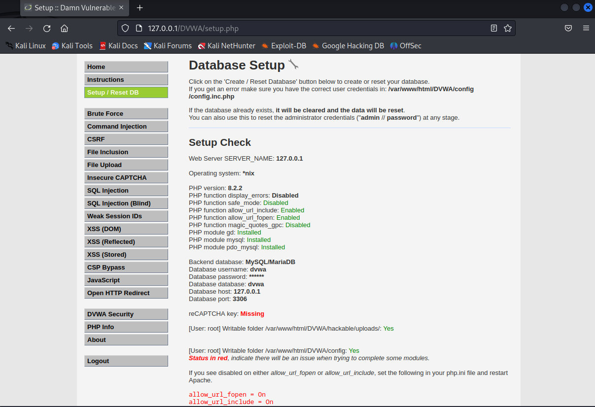
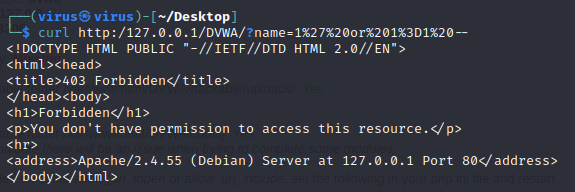

# Instruction

Here are some information when ultilizing these scripts. 

------

> Important: All the scripts need to run as `root` privileges 

> Tested on Kali Linux 2023.1

## `setup-php8.2-environment.sh` (Optional)

If your PHP version is not support `php-gd`, you may need a latter version. This script will ask you to indicate the **old PHP version** (for removing) and **new PHP version** (for installing), I suggest that the new one should be `8.2` (the latest at this time) and the old one is your choice. 

## `dvwa-full-install.sh`

Fully installing the *DVWA web server*, there would be a phase to prompt you to enter password to **MySQL database** as `root` user. By default, use the same password for `root` user in system. The final result comes up like below:

  

Also, the status for each phase should be all `OK`

## `modsec-basic-install.sh`

Install the basic configuration for ModSecurity. When finished, try to SQLi the web. For example:

  

Also, the status for final phase should be all `OK`. 
